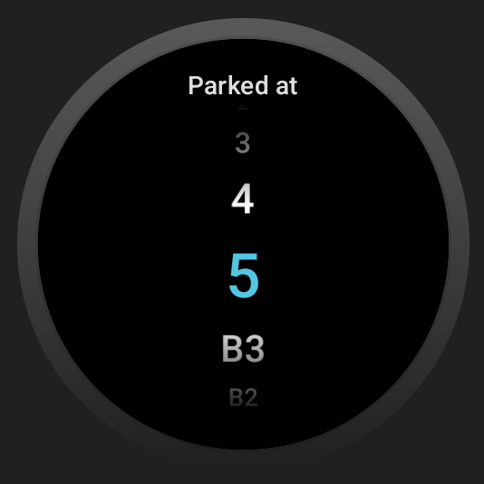

# 🚗 Where is My Car - WearOS Parking Assistant

[](https://opensource.org/licenses/MIT)
[](https://wearos.google.com/)
[](https://kotlinlang.org/)

> **Never lose your car again!** A simple and elegant WearOS app to remember where you parked your car.



## 📱 About

**Where is My Car** is a lightweight WearOS application designed to solve one of the most common problems: forgetting where you parked your car. With just a few taps on your smartwatch, you can quickly save your parking location and retrieve it when you need to find your car.

### ✨ Features

- **Simple & Fast**: Quick parking location saving with minimal taps
- **WearOS Optimized**: Designed specifically for smartwatch interface
- **Standalone App**: Works independently without requiring a phone companion app
- **Battery Efficient**: Minimal resource usage for extended battery life
- **Clean UI**: Intuitive interface optimized for small screens

## 🚀 Getting Started

### Prerequisites

- Android Studio Arctic Fox or later
- WearOS device or emulator
- Minimum API Level: 24 (Android 7.0)

### Installation

1. **Clone the repository**

   ```bash
   git clone https://github.com/yourusername/where-is-my-car.git
   cd where-is-my-car
   ```

2. **Open in Android Studio**

   - Launch Android Studio
   - Open the project folder
   - Wait for Gradle sync to complete

3. **Build and Run**
   - Connect your WearOS device or start an emulator
   - Click the "Run" button or use `./gradlew installDebug`

### Building from Source

```bash
# Build debug APK
./gradlew assembleDebug

# Build release APK
./gradlew assembleRelease

# Install on connected device
./gradlew installDebug
```

## 🤝 Contributing

We welcome contributions! Here's how you can help:

## 📄 License

This project is licensed under the MIT License.

---

**Made with ❤️ for myself 🤣**

_If this app helps you find your car, consider giving it a ⭐ on GitHub!_
